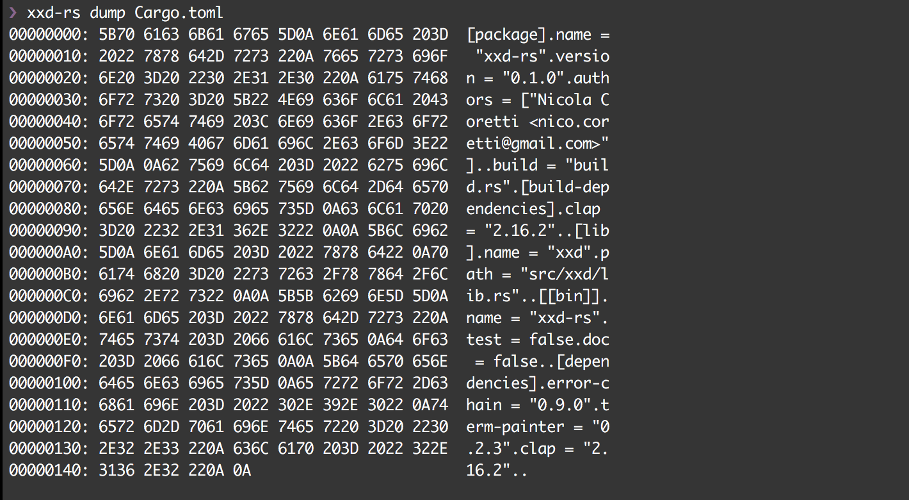
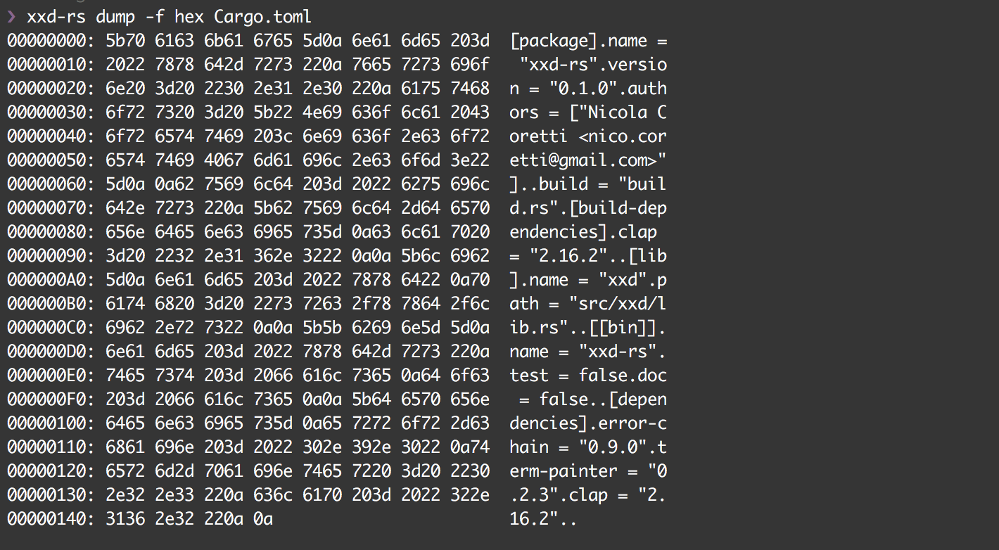
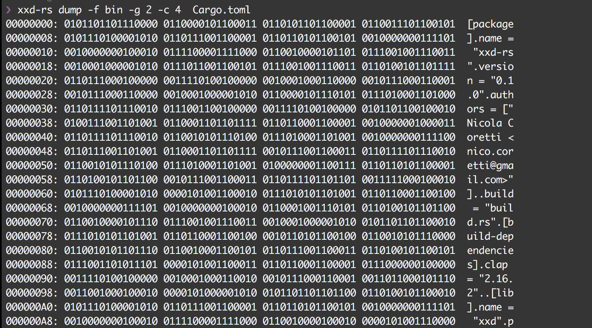
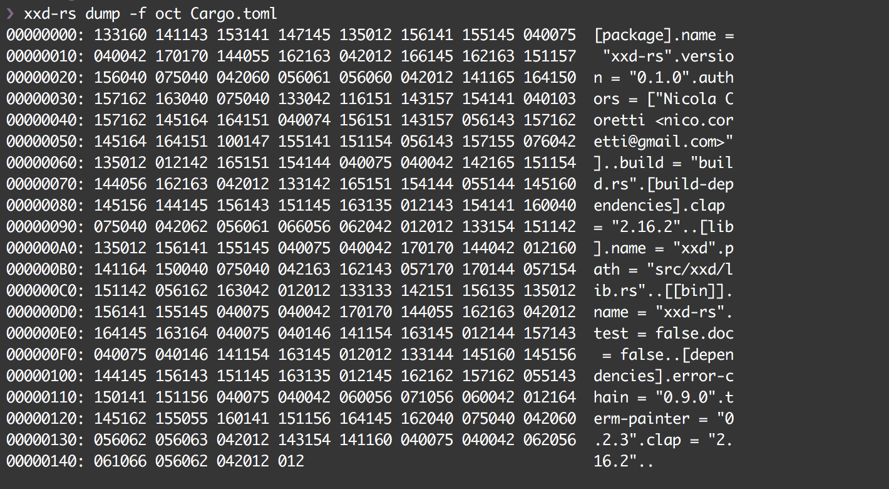
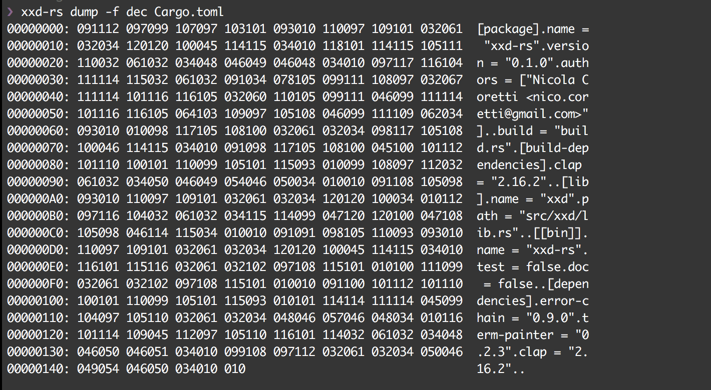
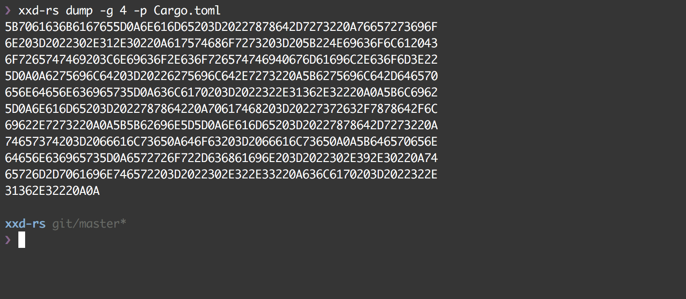

[](https://travis-ci.org/Nicoretti/xxd-rs)
[](https://ci.appveyor.com/project/Nicoretti/xxd-rs/branch/master)

# xxd-rs
A rust based reimplementation of Juergen Weigert's hexdump utility, xxd.

1. Mission statement
    - Goals
    - Non Goals
2. Examples
3. Usage
    - convert
    - dump
    - generate
    - help
4. Compatibility
    - xxd
    - od
    - hexdump

## Mission statement
This project was created to learn rust, therefore there is no perf
If you wanna use the proect or contribute feel free, but please take note
of the goal(s) and non goals so you won't waste ur time or get frustrated.

### Goals
1. Learn rust
2. Provide a rust based replacement for xxd
3. Strive towards a clean rust code base
    - rustfmt
    - Add/refactor towards common rust idioms
4. Useability
    - Provide user friendly defaults
    - Provide clear and well documented command line tools
5. Continously improve the code base

What this Project isn't about

### Non Goals
1. Implement the fastest dump utility out there
    - If you are looking for a performant implementation of xxd
      checkout [go-xxd](https://github.com/felixge/go-xxd)

## Examples
### hex dump



### binary dump


### octal dump


### decimal dump


### plain dump


## Usage
```
USAGE:
    xxd-rs [OPTIONS] [ARGS] [SUBCOMMAND]

FLAGS:
    -h, --help       Prints help information
    -V, --version    Prints version information

OPTIONS:
    -l, --length <length>    Amount of bytes which shall be read
    -s, --seek <seek>        Offset in the file where to start reading

ARGS:
    <infile>     Input file which shall be used (default: stdin)
    <outfile>    File to which the output will be written (default: stdout)

SUBCOMMANDS:
    convert     Converts input data to a file (e.g. hexstream -> binary file
    dump        Dumps an input file in the appropriate output format
    generate    Generates a source file containing the specified file as array
    help        Prints this message or the help of the given subcommand(s)
```
### convert
Not implemented yet

### dump
```
USAGE:
    xxd-rs dump [FLAGS] [OPTIONS] [ARGS]

FLAGS:
    -h, --help             Prints help information
    -p, --plain-hexdump    output in postscript plain hexdump style.
    -V, --version          Prints version information

OPTIONS:
    -c, --columns <columns>          Specifies the amount of output columns
    -f, --format <format>            Specifies the output format for the value (default: Hex) [values: Hex, hex, bin, oct, dec]
    -g, --group-size <group-size>    Separate  the output of every <bytes> bytes (two hex characters or eight bit-digits each) by a whitespace.
    -l, --length <length>            Amount of bytes which shall be read
    -s, --seek <seek>                Offset in the file where to start reading

ARGS:
    <infile>     Input file which shall be used (default: stdin)
    <outfile>    File to which the output will be written (default: stdout)
```
### generate
Not implemented yet

### help
Prints this message or the help of the given subcommand(s)

## Compatibiility
### xxd

```
user@host:~$ xxd file
```

```
user@host:~$ xxd-rs -f hex file
```
### od
### hexdump

